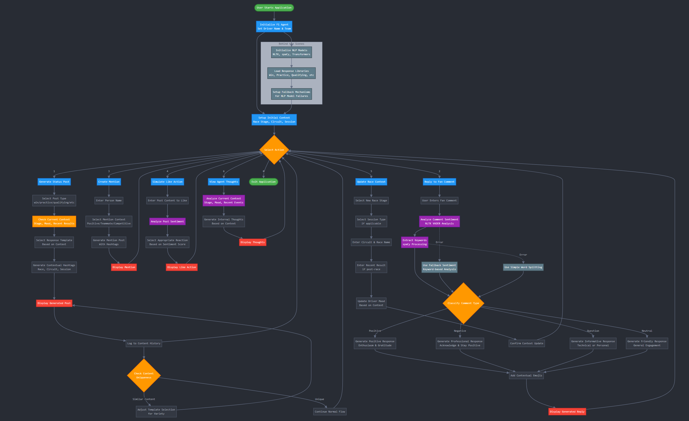

# Submission F1 Racer AI Agent
## Created by Tevin Richard

## Overview 
This is my basic attempt at creating the requested  Formula 1 racer simulation system that generates authentic social media content and fan interactions using advanced Natural Language Processing capabilities. The agent was designed and developed as per the assessment criteria which includes contextual awareness of race weekends, understands sentiment in fan comments, and most importantly the ability to produce dynamic responses that capture the personality of a professional F1 driver.

I have assumed relevant configuration settings for the agent based on common F1 racing concepts as you will see in your interactions with my agent.

**PS: I loved the Disney Cars movies growing up so I decided to work the famous Lightening McQueen into my agent!**

### Key Capabilities


- **Agent Context Configuration and real time adaptation**: Initially set the context of the adjust to configure it's persona which adjusts the personality and messaging based on current race weekend stage and recent performance

- **Contextual Content Generation:**  Creates authentic racing content that adapts to the race weekend situation. .

- **Intelligent Fan Interaction:** Understands the sentiment and intent behind fan comments to deliver appropriate responses. The agent can detect questions ("How did you manage that overtake?"), positive praise ("Amazing drive!"), criticism, or neutral observations, then select response templates that match the fan's emotional tone and topic. 

- **Dynamic Response System:** Prevents repetitive content by using a diverse response library with multiple templates for each situation. The agent tracks previously generated content and selects different phrasings, emojis, and hashtags to keep interactions fresh and authentic.

- **Multi-Modal Communication:** Handles various social media activities including:

   - Status updates for different race contexts (pre-race, post-qualifying, victory celebrations)
   - Personalized replies to fan comments with appropriate emotional tone
   - Mentions of teammates and competitors with context-appropriate messages
   - Simulated "liking" of content with sentiment analysis
   - Internal "thoughts" that reveal the driver's perspective
   - Real-time Context Adaptation: Shifts personality and messaging based on the current situation. T

- **Personality Consistency:** Maintains the authentic voice of a professional F1 driver across all interactions, balancing competitive spirit, technical knowledge, and fan appreciation while avoiding controversial topics or inappropriate responses.

- **Interactive Demo Capabilities:**  Includes pre-configured scenarios to demonstrate different racing situations, allowing users to experience the full range of agent responses without needing to manually set up each race context.


## Architecture & Modules

### Core Components

#### 1. **F1RacerAgent** (`f1_agent.py`)
The main agent class that orchestrates all functionality:
- Maintains race context and driver state
- Coordinates with NLP processor for text analysis
- Manages response generation and content libraries
- Tracks interaction history and content uniqueness

#### 2. **NLPProcessor** (`f1_agent.py`)
Handles all natural language processing operations:
- **NLTK Integration**: Sentiment analysis using VADER, tokenization, POS tagging
- **spaCy Processing**: Entity recognition, dependency parsing, linguistic analysis
- **Transformers Support**: GPT-2 based text generation with fallback mechanisms
- **Robust Error Handling**: Graceful degradation when NLP models are unavailable

#### 3. **RaceContext** (`f1_agent.py`)
State management system that tracks:
- Current race weekend stage (Practice → Qualifying → Race → Post-race)
- Session details (Free Practise (FP), Qualifiers (Q), Race)
- Recent results and performance data
- Circuit information and race metadata
- Driver mood and emotional state

#### 4. **Interactive Interface** (`run_agent.py`)
Command-line interface providing:
- Agent configuration and setup
- Context management and updates
- Interactive content generation
- Demo scenarios and race weekend simulation

### Supporting Systems

#### 5. **Response Libraries** (`f1_agent.py`)
Structured content templates for:
- Race result celebrations and disappointments. These have been configured so that they canb be edited, updated or ammended as required.
- Practice and qualifying session updates
- Fan interaction (like) reply (comments)  frameworks
- Mention templates for teammates and competitors
- The template library can be updated or expanded to increase to variety of responses over time.

#### 6. **Testing Suite** (`test_agent.py`)
Comprehensive validation system covering:
- NLP functionality and accuracy
- Content generation quality and uniqueness
- Context awareness and state transitions
- Performance benchmarking and error handling
- This module helps perform a quick diagnostic check on the agent

## Simplified Application Flow

```
1. User Interaction
   ↓
2. Interface Layer (CLI/Docker)
   ↓
3. Agent Coordination Layer - get context from user via the CLI/Docker interface
   ↓
4. Context Analysis & State Management - Sets the context/persona of the agent
   ↓
5. NLP Processing (Sentiment, Keywords, Entities) - interactions with the agent
   ↓
6. Content Generation (Templates + NLP Enhancement) - outputs from the agent
   ↓
7. Response Delivery & History Tracking 
```

### Detailed Process Flow

1. **Context Setup**: Agent receives race weekend information, driver details, and current stage
2. **Content Request**: User requests specific content type or interaction (post, reply, mention, etc.)
3. **NLP Analysis**: If responding to comments, analyzes sentiment and extracts keywords
4. **Template Selection**: Chooses appropriate response templates based on context and mood
5. **Content Enhancement**: Applies NLP-driven vocabulary selection and personalization
6. **Hashtag Generation**: Creates contextually relevant hashtags for social media posts
7. **Response Delivery**: Returns polished content with appropriate formatting and emojis


## Technical Implementation Details

### NLP Pipeline Architecture

1. **Text Preprocessing**: Tokenization, normalization, and cleaning
2. **Sentiment Analysis**: VADER lexicon-based scoring with contextual adjustments
3. **Entity Recognition**: spaCy NER for extracting racing-related entities
4. **Keyword Extraction**: POS-tag based filtering for relevant content terms
5. **Content Generation**: Template-based foundation with NLP-enhanced vocabulary selection

### Context Awareness System

The agent maintains sophisticated awareness through:
- **Temporal Context**: Understanding of race weekend progression
- **Performance Context**: Recent results and their emotional impact
- **Social Context**: History of interactions and content patterns
- **Environmental Context**: Circuit characteristics and race-specific factors

### Content Variation Mechanisms

- **Template Rotation**: Multiple response patterns per context type
- **NLP-Enhanced Selection**: Vocabulary pools selected based on sentiment and keywords
- **Dynamic Hashtag Generation**: Context-aware social media tagging
- **Recency Tracking**: Prevents repetitive content through history analysis


### Diagramatic representation of Agent operation:


## Setup Instructions

### Prerequisites

- Python 3.8 or higher
- 2GB+ RAM recommended for optimal NLP model performance
- Internet connection for initial model downloads
- Docker installation (if running the Docker Container build method)

I have include two options for getting started with my F1 agent: 

1. Docker method - This is quick and can be set up with a few minutes with simple 2 bash commands (assuming you aldready have docker engine installed on your PC)

2. Manual setup method - This method involves setting up a virtual environment on your PC and configuring that environment for running my agent. I have made this simpler by adding the "setup.sh" bash script to my repo so that you can configure the environment and all required packages with one bash terminal prompt. 

NB: I developed my submission on a Windows PC.

### Quick Start with Docker (Recommended)

```bash
# Clone the repository
git clone https://github.com/unismartsolutions/f1_racer_ai_agent.git
cd f1-racer-agent

# Build the docker container - if you get an error, please chekc that docker enginer is running
docker build -t f1-racer-agent .

# Run the container to start the application
docker run -it f1-racer-agent
```

### Manual Installation

```bash
# 1. Run the setup script - assuming you will be using a Bash Terminal. 
# This scrip will create the virtual environment, activate it, install requirements, run the python script to download all required NLTK packages and download the required SpaCy model
. setup.sh

# 2. Run the agent

# There are two scripts that may be run:

python run_agent.py  # Interactive mode - This mode allows the user to interact with the F1 agent using the CLI interface in the bash terminal

python f1_agent.py   # Demo mode - This mode which the mail script will simply print the demo scenarios to the user. THe user may cycle through the scenarios by pressing "Enter" until all 4 scenarios are complete.
```

### Troubleshooting Setup Issues

If you encounter NLTK download errors: 

You may or may not experience some issues but every now and then I get errors with specific NLTK models. I have provided a manual troublehsootin guide below incase you have any issues:

```bash
python setup_nltk.py
python -c "import nltk; nltk.download('punkt_tab')"
python -c "import nltk; nltk.download('vader_lexicon')"
```

For spaCy model issues:
```bash
python -m spacy download en_core_web_sm --force-reinstall
```

## Usage Examples - How to use the F1 Agent

### Interactive Mode

```bash
python run_agent.py
```

1. Configure driver name and team - You can just press enter to use my preconfigured Defaults 
2. Set race weekend context (circuit, stage, session) - Same as above just press enter for fast config with defaults
3. Choose from available actions:
   - Generate status posts
   - Reply to fan comments
   - Create mentions
   - Simulate a Like Action
   - Update race context - If you want to reconfigure the agent and change persona/behabviour
   - View Agent Thoughts - Get a view of the agent thinking process to debug or understand the response generated
   - View agent infirmation - Lets you see the details of the agent based on previous interactions
   - Run Demo Scenarios - Invoke the sample scenarios to understand the agent behavior and output
   - Quick Race Weekend Simulation - Simulate a race weekend

### Programmatic Usage

The following sample usage shows how to use the F1 agent programmatically in a python application.
This would be useful if the Agent is to be incorporated as a service withing other applications. 

```python
from f1_agent import F1RacerAgent, RaceStage, RaceResult

# Create and configure agent
agent = F1RacerAgent("Lewis Hamilton", "Mercedes AMG")

# Set race context
agent.update_context(
    stage=RaceStage.POST_RACE,
    last_result=RaceResult.WIN,
    position=1,
    circuit_name="Silverstone",
    race_name="British Grand Prix"
)

# Generate content
victory_post = agent.speak("win")
fan_reply = agent.reply_to_comment("Amazing drive today!")
internal_thoughts = agent.think()
```

### Sample Outputs

The following sample outputs were generated to demonstrate the capabilities of my F1 agent. please see the outputs generated from the agent for the various scenarios that were tested. 

**Generate Status Post - General Post 1:**
```
Working hard with the team to extract every bit of performance! #GermanGP #F1 #Speed #TeamRusteez
```

**Generate Status Post - After a Win Post 1:**
```
YES! Absolutely buzzing! Massive thanks to the incredible crew for this 
phenomenal car. We were extracting pace all race long and it paid off! 🏆 
#BritishGP #Victory #P1 #F1 #TeamMercedes
```

**Generate Status Post - After a Win Post 2:**
```
YES! What an incredible race! Can't believe we pulled that off! #GermanGP #Victory #P1 #Champions #TeamWork
```

**Generate Status Post - Podium Post 1:**
```
Happy with that result! We maximized what we had today! #GermanGP #Podium #Points #TeamWork #Motorsport
```

**Generate Status Post - Disappointing (After a difficult race) Post 1:**
```
Not the result we wanted. Gave everything but it wasn't enough today! #GermanGP #NeverGiveUp #ComeBackStronger #Racing #Motorsport
```

**Generate Status Post - Disappointing (After a difficult race) Post 2:**
```
Not our day today but the team never gives up. On to the next one! #GermanGP #NeverGiveUp #ComeBackStronger #Racing #TeamWork
```

**Generate Status Post - Practice Post 1:**
```
Car balance is coming together! Positive signs for tomorrow! #GermanGP #Practice #Speed #F1 #TeamRusteez
```

**Generate Status Post - Practice Post 2:**
```
Making steady improvements! Each session teaches us something new! #GermanGP #Practice #F1 #Speed #TeamRusteez
```

**Generate Status Post - Qualifying Post 1:**
```
Q-day! Feeling confident about our pace! Time to put it together! #GermanGP #Qualifying #Quali #Racing #F1
```

**Reply to Fan Comment 1 (positive)**
```
Comment: Great job on the track today! Rooting for you!

Agent response: Appreciate it! Love hearing from enthusiastic fans! 🙏❤️
```

**Reply to Fan Comment 2 (negative)**
```
Comment: You really messed up there today!

Agent response: Thanks for the honest feedback! Always room for improvement! 👍🙏
```

**Reply to Fan Comment 3 (Question)**
```
Comment: Awesome performance. How do you do it?

Agent response: Good question! Fan curiosity keeps us grounded! 🤔😊
```


**Mention Teammate/Competitor 1**
```
Person's Name: Tevin 
Context: Positive

Agent response: Hat off to @Tevin! The competition makes us all stronger! #GermanGP #Speed #Racing #TeamRusteez
```

**Mention Teammate/Competitor 2**
```
Person's Name: Tevin 
Context: Teammate

Agent response: @Tevin bringing the speed! Teamwork makes the dream work! #GermanGP #Motorsport #F1 #TeamRusteez
```

**Mention Teammate/Competitor 3**
```
Person's Name: Tevin 
Context: Competitor

Agent response: Game on @Tevin! May the best driver win! #GermanGP #Racing #Motorsport #TeamRusteez
```

**Simulate Like action 1**
```
Please note that I have chosen an action of providing an emoji response as the action to the comment. In a real world scenarip this can be linked to APIs to actually drive a generated repsonse or other interaction via API/tools.

Post Content to Like: Great drive today Tevin.


Agent Action: 🔥 This is fire: Great drive today Tevin.
```

**Simulate Like action 1**
```
Post Content to Like: Phenomenal racing. Such an inspiration!


Agent Action: ❤️❤️❤️ Absolutely loved: Phenomenal racing. Such an inspiration!
```

**Update Race Context**
The following options are available to update the Race Context for the Agent to consider when generating new responses:
```
1. Practice 
2. Qualifying
3. Race
4. Post Race


Next allowed:
Enter the curcuit name to update context
Enter race name to update context
Select last result (Win, Podium, Points, DNF, Crash, Disappointing)
Select Mood 

```

**View Agent Thoughts**

Get some context of the Agent's thinkings:

```
💭 Internal thoughts: The team's dedication never ceases to amaze me. Each race weekend brings new challenges and opportunities.
```

**View Agent Info** 

Shows a printout of the Agents configuration and operating information:

```
Sample: 

Agent Information:
  Racer Name: Lightening Mcqueen
  Team Name: Rusteez

  Current Race Context:
  ➤ Current Stage: practice
  ➤ Session Type: FP1
  ➤ Circuit: Nurburgring
  ➤ Race: German Grand Prix
  ➤ Mood: neutral
  ➤ Recent Posts Count: 0
  ➤ Interaction History Count: 1
```


**Run Demo Scenarios** 

Run demo scenarios to understand what the Agent can do:

```
Demo Scenario 1:

1. Practice Session at Nurburgring
----------------------------------------
Context updated: practice at Nurburgring (Mood: focused)
Generating post for context: general
Status: Feeling comfortable with the car! Good progress in FP2! #GermanGP #FP2 #Practice #TeamWork #Speed
Thoughts: 💭 Internal thoughts: Working closely with the engineers to find the right balance. Every lap teaches us something new about the car.
Analyzing comment: 'Amazing drive today!'
Sentiment: 0.62 (pos: 0.67, neg: 0.00)
Comment type: positive
Reply to 'Amazing drive!': Thanks! Your enthusiasm gives us incredible motivation! 🙏❤️


Demo Scenario 2:

2. Victory at Silverstone
----------------------------------------
Context updated: post_race at Silverstone (Mood: ecstatic)
Generating post for context: general
Status: VICTORY! Absolutely buzzing right now! Massive thanks to the entire team! #BritishGP #Victory #P1 #Champions #TeamWork
Thoughts: 💭 Internal thoughts: Reflecting on the weekend and looking ahead. That win shows what's possible when everything clicks!
Analyzing comment: 'Amazing drive today!'
Sentiment: 0.62 (pos: 0.67, neg: 0.00)
Comment type: positive
Reply to 'Amazing drive!': Thanks! Your enthusiasm gives us incredible motivation! 🙏❤️

Demo Scenario 3: 

3. DNF at Spa
----------------------------------------
Context updated: post_race at Spa-Francorchamps (Mood: disappointed)
Generating post for context: general
Status: Sometimes racing breaks your heart. But we'll keep fighting! #BelgianGP #NeverGiveUp #ComeBackStronger #F1 #Speed
Thoughts: 💭 Internal thoughts: Setbacks like this only make us more determined. Reflecting on the weekend and looking ahead.
Analyzing comment: 'Amazing drive today!'
Sentiment: 0.62 (pos: 0.67, neg: 0.00)
Comment type: positive
Reply to 'Amazing drive!': Thank you! Love connecting with passionate fans like you! 🙏❤️
```

## Development & Testing

### Running Tests

I have include a test script to run diagnostic tests on the agent which can be run periodically or to simply get a print out of the agent's various capabilities. 

#### Run as follows:

```bash
python test_agent.py
```

#### Test output: 

```
NLTK loaded successfully
spaCy loaded successfully
F1 Racer AI Agent - Test Suite
========================================

Testing Agent Initialization...
NLTK loaded successfully
spaCy loaded successfully
PASS: Default agent creation
NLTK loaded successfully
spaCy loaded successfully
PASS: Custom agent creation
PASS: Context initialization
    Racer: Test Driver

Testing Context Updates...
Context updated: qualifying at Circuit (Mood: intense)
PASS: Stage update
Context updated: post_race at Monaco (Mood: ecstatic)
PASS: Full context update
Context updated: post_race at Monaco (Mood: ecstatic)
PASS: Mood update
    Mood: ecstatic

Testing NLP Capabilities...
PASS: NLP sentiment analysis
    All sentiment analyses successful
PASS: NLP keyword extraction
    Extracted keywords: ['great', 'feels', 'car']

Testing Text Generation...
Generating post for context: general
PASS: Text generation - general
    Length: 114, Preview: 'VICTORY! Absolutely buzzing right now! Massive tha...'
Context updated: post_race at Monaco (Mood: ecstatic)
Generating post for context: win
PASS: Text generation - win
    Length: 102, Preview: 'What a race! Couldn't have done it without this in...'
Context updated: practice at Monaco (Mood: focused)
Generating post for context: practice
PASS: Text generation - practice
    Length: 98, Preview: 'Feeling comfortable with the car! Good progress in...'
Context updated: qualifying at Monaco (Mood: intense)
Generating post for context: qualifying
PASS: Text generation - qualifying
    Length: 108, Preview: 'Qualifying mode activated! Time to extract every b...'
Context updated: post_race at Monaco (Mood: disappointed)
Generating post for context: disappointing
PASS: Text generation - disappointing
    Length: 129, Preview: 'Not our day today but the team never gives up. On ...'

Testing Reply Generation...
Analyzing comment: 'Great drive today!'
Sentiment: 0.66 (pos: 0.69, neg: 0.00)
Comment type: positive
PASS: Reply to: 'Great drive today!...'
    Reply: 'Thanks! Always trying to extract every tenth for t...'
Analyzing comment: 'Unlucky with the result, better next time'
Sentiment: 0.44 (pos: 0.33, neg: 0.00)
Comment type: negative
PASS: Reply to: 'Unlucky with the result, bette...'
    Reply: 'I appreciate honest feedback. Pushes us to extract...'
Analyzing comment: 'What's your favorite circuit?'
Sentiment: 0.46 (pos: 0.50, neg: 0.00)
Comment type: question
PASS: Reply to: 'What's your favorite circuit?...'
    Reply: 'Good point! Circuit knowledge is crucial in F1! 🤔😊...'
Analyzing comment: 'Amazing performance!'
Sentiment: 0.62 (pos: 0.80, neg: 0.00)
Comment type: positive
PASS: Reply to: 'Amazing performance!...'
    Reply: 'Thank you so much! Comments like this make all the...'
Analyzing comment: 'Keep pushing, we believe in you!'
Sentiment: 0.00 (pos: 0.00, neg: 0.00)
Comment type: neutral
PASS: Reply to: 'Keep pushing, we believe in yo...'
    Reply: 'Thanks for taking the time to comment! 🙏...'
Analyzing comment: 'That was an incredible overtake!'
Sentiment: 0.00 (pos: 0.00, neg: 0.00)
Comment type: positive
PASS: Reply to: 'That was an incredible overtak...'
    Reply: 'Means the world! Fan energy like this is what driv...'

Testing Enhanced Reply Analysis...
Analyzing comment: 'Amazing drive today! You were flying out there!'
Sentiment: 0.66 (pos: 0.39, neg: 0.00)
Comment type: positive
PASS: Enhanced reply - positive
    Sentiment: 0.66, Reply: 'Thank you so much! Comments like this ma...'
Analyzing comment: 'Tough luck with the DNF, but we know you'll bounce back'
Sentiment: 0.19 (pos: 0.16, neg: 0.10)
Comment type: neutral
PASS: Enhanced reply - supportive
    Sentiment: 0.19, Reply: 'Thanks for taking the time to comment! 🙏...'
Analyzing comment: 'What's your favorite part about racing at Monaco?'
Sentiment: 0.46 (pos: 0.30, neg: 0.00)
Comment type: question
PASS: Enhanced reply - question
    Sentiment: 0.46, Reply: 'Love racing questions! Every battle is a...'
Analyzing comment: 'Keep pushing! The team is behind you 100%'
Sentiment: 0.00 (pos: 0.00, neg: 0.00)
Comment type: neutral
PASS: Enhanced reply - motivational
    Sentiment: 0.00, Reply: 'Thanks for commenting! Love connecting w...'

Testing Mention Generation...
PASS: Mention - positive
    Preview: 'Props to @Carlos Sainz! Amazing driving today! #MonacoGP #F1...'
PASS: Mention - competitive
    Preview: 'Game on @Max Verstappen! May the best driver win! #MonacoGP ...'
PASS: Mention - teammate
    Preview: '@George Russell bringing the speed! Teamwork makes the dream...'

Testing Like Simulation...
PASS: Like simulation
    Action: '🔥 This is fire: 'Great race today everyone!''
PASS: Like simulation
    Action: '🤝 Respect: 'Looking forward to next weekend''
PASS: Like simulation
    Action: '🙌 Supported: 'Team work makes the dream work''

Testing Thinking Capability...
Context updated: practice at Monaco (Mood: focused)
PASS: Thinking - practice
    Preview: '💭 Internal thoughts: Complete focus on the task at hand. Eve...'
Context updated: qualifying at Monaco (Mood: intense)
PASS: Thinking - qualifying
    Preview: '💭 Internal thoughts: Need to find that perfect lap when it m...'
Context updated: race at Monaco (Mood: determined)
PASS: Thinking - race
    Preview: '💭 Internal thoughts: Managing tires and fuel will be crucial...'
Context updated: post_race at Monaco (Mood: neutral)
PASS: Thinking - post_race
    Preview: '💭 Internal thoughts: Always learning, always improving. Refl...'

Testing Hashtag Generation...
Context updated: practice at Monaco (Mood: focused)
Generating post for context: general
PASS: Hashtag generation - practice
    Found hashtags in: ' tomorrow! #TestGP #FP1 #Practice #TeamWork #Speed'
Context updated: qualifying at Monaco (Mood: intense)
Generating post for context: general
PASS: Hashtag generation - qualifying
    Found hashtags in: ' good! #TestGP #Qualifying #Quali #Speed #TeamWork'
Context updated: post_race at Monaco (Mood: neutral)
Generating post for context: general
PASS: Hashtag generation - post_race
    Found hashtags in: 'es next! #TestGP #Racing #Motorsport #TeamTestTeam'

Testing Dynamic Responses...
Context updated: practice at Monaco (Mood: focused)
Generating post for context: practice
Generating post for context: practice
Generating post for context: practice
Generating post for context: practice
Generating post for context: practice
PASS: Response uniqueness
    Unique: 5/5 (100.0%)

Testing NLP Mood Analysis...
Context updated: post_race at Monaco (Mood: ecstatic)
PASS: NLP mood analysis - win
    Expected: positive, Got: ecstatic
Context updated: post_race at Monaco (Mood: disappointed)
PASS: NLP mood analysis - dnf
    Expected: negative, Got: disappointed
Context updated: post_race at Monaco (Mood: positive)
PASS: NLP mood analysis - podium
    Expected: positive, Got: positive
Context updated: practice at Monaco (Mood: focused)
PASS: NLP mood analysis - neutral
    Expected: focused, Got: focused

Testing Agent Info...
PASS: Agent info structure
    Fields: ['racer_name', 'team_name', 'current_stage', 'session_type', 'circuit', 'race', 'last_result', 'position', 'mood', 'recent_posts_count', 'interaction_history_count', 'recent_sentiment_compound', 'recent_sentiment_positive', 'recent_sentiment_negative']

Testing Race Weekend Simulation...
Context updated: practice at Test Circuit (Mood: focused)
Generating post for context: general
Context updated: practice at Test Circuit (Mood: focused)
Generating post for context: general
Context updated: qualifying at Test Circuit (Mood: intense)
Generating post for context: general
Context updated: race at Test Circuit (Mood: determined)
Generating post for context: general
Context updated: post_race at Test Circuit (Mood: neutral)
Generating post for context: general
PASS: Race weekend simulation
    Successfully progressed through all stages

Testing Performance...
Generating post for context: general
Generating post for context: general
Generating post for context: general
Generating post for context: general
Generating post for context: general
Generating post for context: general
Generating post for context: general
Generating post for context: general
Generating post for context: general
Generating post for context: general
PASS: Response generation performance
    Average: 0.000s per response

========================================
TEST SUMMARY
========================================
Total Tests: 44
Passed: 44
Failed: 0
Pass Rate: 100.0%
Overall Status: EXCELLENT

========================================
```


### Performance Metrics

- Response generation: < 0.1s average
- Content uniqueness: > 80% for repeated requests
- Sentiment analysis accuracy: High correlation with manual evaluation
- Context retention: Maintains state across complex race weekend scenarios

## File Structure

```
f1-racer-agent/
├── f1_agent.py           # Core agent implementation
├── run_agent.py          # Interactive CLI interface
├── test_agent.py         # Comprehensive test suite
├── setup_nltk.py         # NLP model setup utility
├── requirements.txt      # Python dependencies
├── Dockerfile           # Container configuration
├── setup.sh            # Automated setup script
├── .gitignore          # Version control exclusions
└── README.md           # Project documentation
```

## Dependencies & Requirements

### Core NLP Libraries
- **NLTK 3.8+**: Sentiment analysis, tokenization, POS tagging
- **spaCy 3.4+**: Entity recognition, linguistic processing
- **Transformers 4.21+**: Advanced text generation capabilities
- **PyTorch**: Neural network model execution

### Supporting Libraries
- **TextBlob**: Additional text processing utilities
- **NumPy**: Numerical computations for NLP operations

### Development Tools
- **pytest**: Test framework for validation
- **Docker**: Containerization for consistent deployment

## Future Enhancements

- Web-based interface for broader accessibility
- Enhanced template handling - Increase diversity to ensure dynamic responses 
- Convert key functionalities into flask API services to allow for intergration into new/existing applications
- Integration with real F1 data feeds for live context updates - Possiblity to hook into News/Sporting platform APIs
- Multi-language support for international fan engagement
- Advanced personality customization and driver-specific traits
- Real-time social media platform integration - Connecting agent ouput to social media webhooks and APIs
- Enhanced emotional intelligence and context understanding
- Integration with LLMs for enhanced context generation
- Front end development for the Agent interactions


# Closing remarks

I hope that you have enjoyed going through my Agent application. This was a fun project to work on and I enjoyed every moment of it. 

I decided to go a step further and demonstrate how we could take a slighlty more advanced implementation of the agent using an Agent framework (Langchanin), together with an LLM (GPT-4o-mini). 

For this I have developed another repo named "f1_racer_ai_agent_advanced" - https://github.com/unismartsolutions/f1_racer_ai_agent_advanced . This repo contains the advabned implementation which was deployed to an Azure Web Application for you to explore and experiment with. 

I hope that you find this additional/alternate approach useful as this demonstrates how we could leverage the power of emerging LLMs to create mope powerful, relevant and creative content via the F1 Agent. 

App link: https://f1-racer-agent-app.azurewebsites.net/
Login Details: Provided through consultant

Please feel free to reach out if you have any questions.
